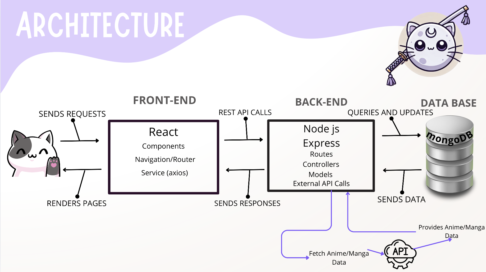
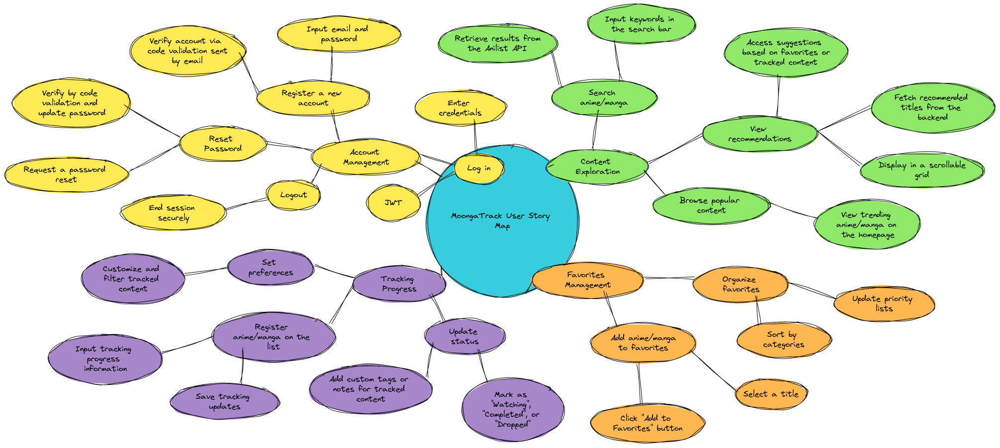

# MoongaTrack
<p align="center"> 
 MoongaTrack by ROSEREAU Maïlys
<p align="center"> 


---

##  OVERVIEW

MoongaTrack is a web application designed for anime and manga enthusiasts. This platform provides a solution to track, explore, and manage your content preferences. With a focus on an intuitive user experience, MoongaTrack enables fans to organize their favorite animes and mangas.

Users can save their list of animes and mangas to follow, explore recommendation lists, and manage their favorites. MoongaTrack stands out for its integration with the public Anilist API and its secure backend.

You can have my project blog article here : [Medium article by ROSEREAU Maïlys](https://medium.com/@8831_5557/moongatrack-tracking-your-anime-and-manga-journey-4dff33f31bba)

---

## 📚 MY RESOURCES

- **React.js**: Official documentation for the frontend.
- **Redux**: Documentation for predictive state management.
- **Node.js**: Documentation for the backend.
- **Express.js**: Documentation for the backend framework.
- **MongoDB**: Guide for the NoSQL database.
- **Mongoose**: MongoDB documentation.
- **JWT**: Introduction to secure user session management.
- **Tailwind CSS**: Documentation for fast and maintainable styling.

---

## 🎥 DEMO 

[Watch the demo](https://github.com/user-attachments/assets/3863e967-ec71-4416-ba1e-0b2660e20452)

---

## 🛠️ TECHNOLOGIES and TOOLS USED

### 🎨 Frontend:

- **React.js**
- **Redux**
- **Axios**
- **Tailwind CSS**

###  Backend:

- **Node.js**
- **Express.js**
- **JWT**
- **Bcrypt.js**
- **Mongoose**
- **Anilist API Integration**

###  Database:

- **MongoDB**

### Infrastructure:

- **Docker**
- **Docker-Compose**

---

## 📈 ARCHITECTURAL DIAGRAM

 

**Description**:

1. **Frontend**: Sends user requests to the backend.
2. **Backend**: Processes requests and applies business logic.
3. **Database**: Stores data for users, registered animes, and mangas.
4. **External API**: Integration with the Anilist API.

---

## 📈 USER STORY DIAGRAM




---


##  INSTALLATION AND CONFIGURATION

### Prerequisites

- Node.js (version 18)
- MongoDB
- Docker (optional)

### Installation

1. Clone the project:

   ```bash
   git clone https://github.com/Mailune/MoongaTrack_v1.0/tree/main 
   cd MoongaTrack_v1.0
   ```

2. Install frontend dependencies:

   ```bash
   cd moonga-track-frontend
   npm install
   ```

3. Install backend dependencies:

   ```bash
   cd ../moonga-track-backend
   npm install
   ```

4. Configure `.env` files:

   - **Frontend**: Set `REACT_APP_API_URL`.
   - **Backend**: Configure `PORT`, `DB_URI`, and `JWT_SECRET`.

5. Start the servers:

   - **Frontend**:
     ```bash
     npm start
     ```
   - **Backend**:
     ```bash
     npm start
     ```

6. Access the application:

   - Frontend: `http://localhost:3000`
   - Backend: `http://localhost:5005`

---

## 💡 USE

### Main Features

1. **Account Management**:

   - Signup, secure login, password reset.

2. **Content Exploration**:

   - Discover popular animes and mangas on the homepage, search for animes and mangas through your profile, and save your selections to your lists. Then update the tracking information!

3. **Favorites Management**:

   - Add your favorite series to your favorites list.

4. **Recommendations**:

   - Get suggestions related to your saved animes and mangas.

---

## FUTURE FEATURES

1. **Email Notifications**: Receive alerts for new releases.
2. **Mobile Application**: A native mobile version for better accessibility.
3. **Share Your Comments and Favorite Series**.

---
## 🛠️ Contributing

Contributions are welcome! To contribute:
1. Fork the repository.
2. Create a new branch for your feature:
   ```bash
   git checkout -b feature-name
   ```
3. Commit your changes:
```bash
git commit -m "Add feature-name"
```
4. Push to your branch:
```bash
git push origin feature-name
```
Open a Pull Request.


---

### Related Projects

```markdown
## Related Projects

- [AniList API](https://anilist.co)
- [MAL API (MyAnimeList)](https://myanimelist.net)
- [Other Anime Trackers](https://www.anime-planet.com)
```

## 📬 CONTACT

**MoongaTrack Team**

- [LinkedIn](https://www.linkedin.com/in/maïlys-rosereau-7471a5302/)
- [My github](https://github.com/Mailune)
- **Mail:** mailysrosereau@yahoo.fr

Copyright (c) 2024 **Maïlys Rosereau**